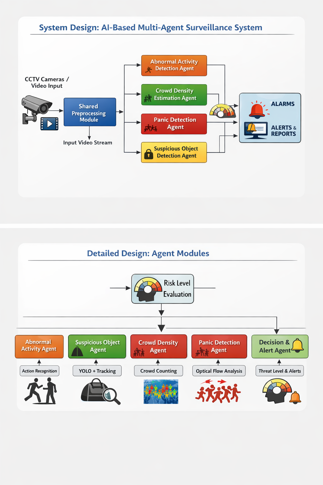

# AI-Based Multi-Agent Crowd Safety Surveillance System for Real-Time Threat Monitoring

**Author:** Replace with student name(s), department, institution, and email  
**Paper type:** IEEE-style project paper draft

## Abstract

Crowd monitoring in public spaces demands intelligent systems that can detect multiple safety threats in real time, including abnormal motion patterns, crowding, panic-like movement, and unattended objects. This paper presents an AI-based multi-agent crowd safety surveillance system that combines a shared video processing backbone with specialized agents for abnormal activity detection, crowd density estimation, panic detection, suspicious object detection, risk fusion, and alert generation. The shared processing pipeline uses YOLOv8 for object detection, DeepSORT for multi-object tracking, and Farneback optical flow for motion estimation. On top of this pipeline, the abnormal activity branch generates a three-channel heatmap representation composed of occupancy, speed, and motion maps, which is processed by a CNN-LSTM model trained on the UCSD Pedestrian dataset. A LangGraph-based orchestration layer enables parallel execution of agents and centralized risk assessment. The system is exposed through a FastAPI backend and a React-based frontend dashboard for live video, agent-level monitoring, and alerts. The implementation demonstrates a modular architecture that supports real-time crowd safety monitoring and provides a foundation for future quantitative benchmarking and deployment.

**Keywords:** crowd safety, multi-agent surveillance, YOLOv8, DeepSORT, optical flow, CNN-LSTM, anomaly detection, LangGraph

## I. Introduction

Public surveillance systems are increasingly expected to do more than record video. In transportation hubs, campuses, malls, and event venues, the monitoring system must interpret the scene and assist operators in detecting potential safety threats before escalation. Manual observation alone does not scale in crowded environments, particularly when multiple risk factors occur simultaneously.

This project addresses that gap by building a real-time AI surveillance platform in which a shared processing module feeds multiple specialized agents. Rather than relying on a single monolithic classifier, the system decomposes scene understanding into interpretable subproblems: abnormal activity, crowd density, panic-like motion, suspicious or unattended objects, and final risk-aware decision support.

The key contribution of the work is a practical end-to-end system that combines learned and rule-based modules under a unified multi-agent architecture. The design supports modular growth, parallel inference, and operator-facing visualization through a web dashboard.

## II. System Overview

The proposed architecture begins with a shared processing stage that extracts reusable scene information from each video frame. This information is consumed by parallel agents and then fused into a risk score and alert report. The current implementation includes the following modules:

- Shared processing: YOLOv8 detection, DeepSORT tracking, optical flow, trajectory enrichment, and `SceneState` generation.
- Abnormal activity agent: occupancy-speed-motion heatmap generation, temporal sequence building, and CNN-LSTM inference.
- Crowd density agent: person counting and density-level estimation.
- Panic detection agent: sudden-run detection using track-level speed history and optical flow.
- Suspicious object agent: unattended bag detection using bag-person association and fallback detection logic.
- Risk evaluation agent: weighted fusion of agent scores into low, medium, high, or critical risk.
- Decision and alert agent: interpretable alert generation and control-room escalation messages.
- Frontend and backend: FastAPI endpoints for status and stream delivery, and a React dashboard for live monitoring.

**Figure 1.** High-level architecture of the proposed AI-based multi-agent surveillance system.

## III. Shared Video Processing Pipeline

The shared pipeline is designed to avoid repeated computation across agents. First, YOLOv8 detects persons and bag-like objects such as backpacks, handbags, and suitcases. The detector output is passed to DeepSORT to preserve track identities across frames. A trajectory manager enriches each track with center coordinates, short-term motion history, velocity, and pixel-domain speed. In parallel, dense optical flow is estimated using the Farneback method to model scene-level motion.

These outputs are stored in a `SceneState` object containing the frame index, timestamp, tracked objects, raw detections, and global motion statistics. This shared state acts as the common interface between video understanding and agent-level reasoning.

## IV. Abnormal Activity Detection

The abnormal activity agent is the learned component of the system. For each frame, a heatmap generator converts scene state into a three-channel representation:

- Occupancy map: spatial distribution of detected persons over a `64 x 64` grid.
- Speed map: average per-cell person speed derived from short-term track motion.
- Motion map: grid-wise aggregation of optical-flow magnitude.

These three channels are stacked into a tensor and buffered into temporal sequences of length `T = 16`. Once the sequence buffer is full, the sequence is passed to a CNN-LSTM network. The CNN encoder extracts spatial features from each heatmap frame, while the LSTM models temporal evolution across the 16-step window. The final sigmoid output represents the abnormality probability, which is thresholded to produce an abnormal/normal decision.

The abnormal activity branch is trained using pre-generated `.npy` sequences built from the UCSD Ped2 dataset. This design allows the model to learn temporal changes in pedestrian occupancy and motion rather than relying only on raw RGB appearance.

## V. Specialized Agents

### A. Crowd Density Agent

The crowd density agent estimates the number of people in the frame and maps it to low, medium, or high density levels. This branch provides a lightweight quantitative indicator of congestion that can contribute to operator alerts even when there is no explicit anomaly.

### B. Panic Detection Agent

The panic detection branch analyzes both global motion and person-level speed variation. A per-track history buffer estimates each person’s baseline speed, and sudden-run behavior is triggered only when a previously slow-moving person exhibits a sustained speed spike. This reduces false alarms from naturally fast walkers and allows the system to mark specific tracks as potential panic triggers.

### C. Suspicious Object Agent

The suspicious object agent targets unattended bags and luggage. It combines tracked bag-person association, owner persistence, distance thresholds, and fallback raw-detection logic for cases where tracking is unstable. The module has been actively tuned to distinguish between carried bags and isolated objects. This branch is currently more heuristic than the abnormal activity model and remains the component most sensitive to scene-specific tuning.

### D. Risk Evaluation and Alert Agent

The risk evaluation agent fuses the outputs of abnormal activity, crowd density, panic, and suspicious object detection. In the current implementation, the weights are `0.40`, `0.20`, `0.25`, and `0.15`, respectively. The combined score is mapped to four operational levels: low, medium, high, and critical. The decision agent then converts this risk estimate into human-readable alerts such as abnormal activity, potential panic, suspicious object, and escalation to the security control room.

## VI. Multi-Agent Orchestration

The system uses LangGraph to organize execution flow. After shared processing, four branches run in parallel: abnormal activity, crowd density, panic detection, and suspicious object detection. Their outputs are merged by the risk evaluation node, followed by a final alert node. This graph-based orchestration improves modularity and makes the reasoning pipeline easier to extend compared with a single procedural loop.

From a software engineering perspective, the graph abstraction also improves maintainability. Each agent owns a well-defined input-output contract centered on `SceneState`, and additional agents can be introduced without redesigning the entire runtime.

## VII. Deployment Interface

To support real-time demonstration and operator interaction, the project includes:

- A FastAPI backend that exposes status endpoints, frame snapshots, and MJPEG stream delivery.
- A React frontend dashboard that displays the live video feed, agent states, risk score, disaster type, and alert messages.
- Pinpoint visualization on the stream for specific events, such as sudden-running persons or unattended objects.

**Figure 2.** Example frame from the surveillance input used during system evaluation and suspicious-object analysis.

## VIII. Experimental Status and Qualitative Results

The project is currently at the stage of real-time integration and system-level validation. The following implementation milestones have been completed:

- Shared processing module built and integrated.
- Scene-state abstraction designed for downstream agent consumption.
- Abnormal activity heatmap representation developed and sequence generation automated.
- CNN-LSTM anomaly model trained on the UCSD Ped2 dataset.
- LangGraph-based multi-agent orchestration implemented.
- FastAPI and React interface created for operational visualization.

Qualitative testing on sample surveillance videos indicates that:

- The abnormal activity branch can generate probability-based scene anomaly estimates once the temporal buffer is filled.
- The panic branch can highlight specific persons using sudden-run logic rather than fixed speed-only thresholds.
- The risk fusion and dashboard layers operate in real time and provide interpretable alerts.
- The suspicious object branch is functional but still undergoing tuning to improve unattended bag precision in crowded scenes and to reduce tracker-induced ambiguity.

At this stage, no formal benchmark table is reported because end-to-end quantitative evaluation, threshold calibration, and systematic annotation of custom test videos are still in progress. This paper therefore emphasizes architecture, implementation, and qualitative system behavior rather than finalized numerical performance.

## IX. Limitations

The current system has several limitations. First, suspicious object detection remains sensitive to detector confidence, bag track stability, and crowd proximity. Second, the risk fusion weights are heuristic and not yet learned from annotated operational data. Third, the abnormal activity model is trained on UCSD Ped2, which differs from many real-world deployment scenes in viewpoint, density, and anomaly types. Finally, the present frontend focuses on live monitoring and alert display rather than long-term analytics, audit trails, or incident retrieval.

## X. Future Work

Future improvements will focus on three directions. The first is quantitative evaluation, including frame-level and event-level metrics across anomaly, panic, and unattended-object scenarios. The second is stronger suspicious-object reasoning through re-identification, longer-term ownership modeling, and scene-calibrated distance measures. The third is deployment maturity, including alert logging, model configuration files, operator review workflows, and exportable incident reports.

## XI. Conclusion

This paper presented an AI-based multi-agent crowd safety surveillance system that combines real-time object detection, tracking, motion estimation, learned abnormality recognition, rule-based safety agents, graph-based orchestration, and a live monitoring dashboard. The architecture demonstrates how shared scene processing can be reused by multiple specialized agents to improve interpretability and extensibility. Although some branches, particularly unattended object detection, still require further calibration, the current implementation establishes a practical and modular foundation for intelligent crowd safety monitoring in real-world environments.

## References

[1] Ultralytics, “Introducing Ultralytics YOLOv8,” 2023. [Online]. Available: https://www.ultralytics.com/blog/introducing-ultralytics-yolov8

[2] N. Wojke, A. Bewley, and D. Paulus, “Simple Online and Realtime Tracking with a Deep Association Metric,” in *2017 IEEE International Conference on Image Processing (ICIP)*, 2017, pp. 3645-3649. doi: 10.1109/ICIP.2017.8296962

[3] G. Farneback, “Two-frame motion estimation based on polynomial expansion,” in *Image Analysis: 13th Scandinavian Conference, SCIA 2003*, 2003, pp. 363-370.

[4] V. Mahadevan, W. Li, V. Bhalodia, and N. Vasconcelos, “Anomaly Detection in Crowded Scenes,” in *2010 IEEE Computer Society Conference on Computer Vision and Pattern Recognition (CVPR)*, 2010, pp. 1975-1981. doi: 10.1109/CVPR.2010.5539872

[5] University of California San Diego, “UCSD Anomaly Detection Dataset,” [Online]. Available: https://www.svcl.ucsd.edu/projects/anomaly/dataset.html

[6] S. Hochreiter and J. Schmidhuber, “Long Short-Term Memory,” *Neural Computation*, vol. 9, no. 8, pp. 1735-1780, 1997. doi: 10.1162/neco.1997.9.8.1735

[7] LangChain, “RunnableLambda,” [Online]. Available: https://api.python.langchain.com/en/latest/core/runnables/langchain_core.runnables.base.RunnableLambda.html

